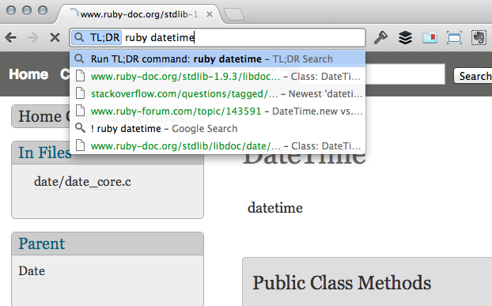

# TLDR - Instant "feeling lucky" Chrome search plugin for the truly impatient

Created by [Dan Adams](http://mrdanadams.com/) ([@danadams](https://twitter.com/danadams))

TLDR is a Chrome plugin that provides a "feeling lucky" instant search; instead of search results the plugin loads the first result directly. TLDR is great for looking up code references or anything where the first result is usually what you want.

[What does "tl;dr" mean?](http://en.wikipedia.org/wiki/Wikipedia:Too_long;_didn't_read)

## Installation

_[Click here to download the plugin](https://raw.github.com/mrdanadams/tldr-chrome-plugin/master/tldr.crx)_

Then (It's not in the Chrome Web Store yet):

1. Click the wrench icon (or 'bars' icon) on the browser toolbar.
2. Select _Tools > Extensions_.
3. Locate the extension file on your computer and drag the file onto the Extensions page.
4. Review the list of permissions in the dialog that appears. If you would like to proceed, click _Install_.

## Usage

In the omnibar simply type `!` followed by tab or space and your search terms. As you type the window below will be updated to reflect the best match for your search.

Hit `esc` to discard the search and go back to the page you started on. Hitting `enter` will leave you on the search result.

## Development

1. Clone the repo
1. Run `bundle`
1. Run `bundle exec jekyll --auto`
1. Go into Tools > Extensions in Chrome. Turn on developer mode. Add the plugin by selecting the `_site` directory.
