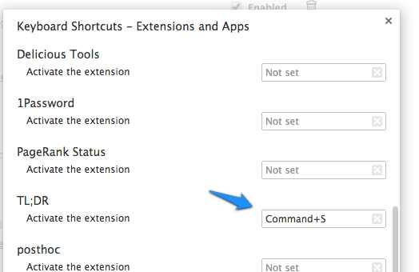

# TL;DR search plugin for Chrome

Created by [Dan Adams](http://mrdanadams.com/) ([@danadams](https://twitter.com/danadams))

TLDR is autocomplete for the internet. It's a Chrome plugin that provides instant search except the page you get is the first result in the search rather than the search results themselves. Great for looking up code reference and other such things where the first result is always right and you search for it often.

## Usage

1. Clone the repo
1. Go into Tools > Extensions in Chrome. Turn on developer mode. Add the plugin by selecting the `_site` directory.
1. Configure a shortcut for the extension by going to _Tools > Extensions_ and hitting _Configure commands_ at the bottom:

## Development

1. Clone the repo
1. Run `bundle`
1. Run `bundle exec jekyll --auto`
1. Go into Tools > Extensions in Chrome. Turn on developer mode. Add the plugin by selecting the `_site` directory.
